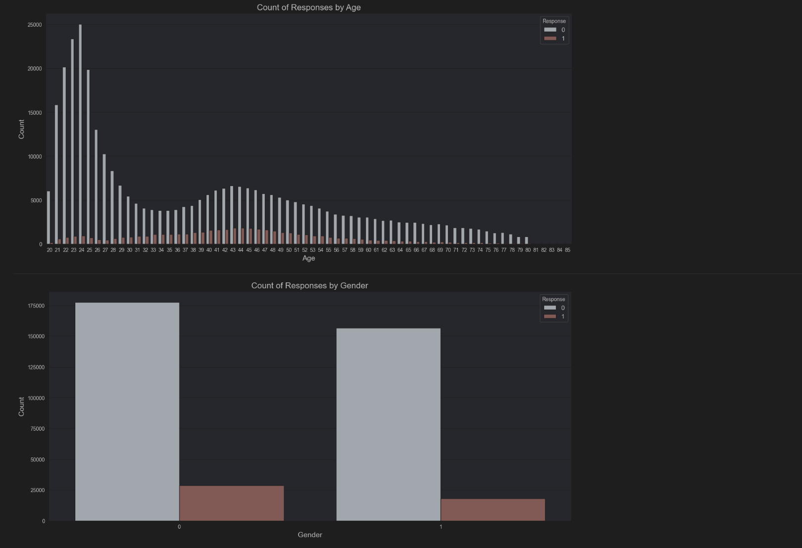

项目第一次跑，AUC的值为0.44 
```
C：正则化系数λ的倒数
penalty：惩罚项
solver：优化算法选择参数
max_iter：迭代次数
multi_class：分类方式选择参数
random_state：随机种子

进行第一轮调优
第一轮参数为
param_grid_1 = {
    'C': [10],
    'penalty': ['l2'],
    'solver': ['liblinear']
}

param_grid_1 = {
    'C': [10],
    'penalty': ['l1'],  r1  l2 ---> l1
    'solver': ['saga'],  r1  liblinear--->saga
    'max_iter': [35],  
    'multi_class': ['ovr']     
增加了max_iter参数和multi_class参数
 0.44022241699387155   ----> 0.44022241699690431
}
```

```
进行第二轮调优
第二轮参数调整为
param_grid_2 = {
    'C': [2],   r2  10--->2
    'penalty': ['l2'],   r2 l1--->r2
    'solver': ['liblinear'],  r2  saga--->liblinear
    'max_iter': [60],   r2 35--->60   
    'multi_class': ['auto']    r2  ovr--->auto
    'random_state' = [4]
增加了random_state参数
整体AUC调整为
 0.44022241699690431   ----> 0.46951958610900135 
}
```

```
进行第三轮轮调优
第三轮参数调整为
param_grid_3 = {
    'C': [0.1],     r3  10--->0.1
    'penalty': ['l1'],  r3 l2--->l1
    'solver': ['saga'],  r3  liblinear--->sage
    'max_iter': [20],   r3 35--->20   
    'multi_class': ['ovr']    r3  auto--->ovr  
去掉了random_state参数
整体AUC调整为
 0.46951958610900135   ----> 0.8320300270771069 
}
```